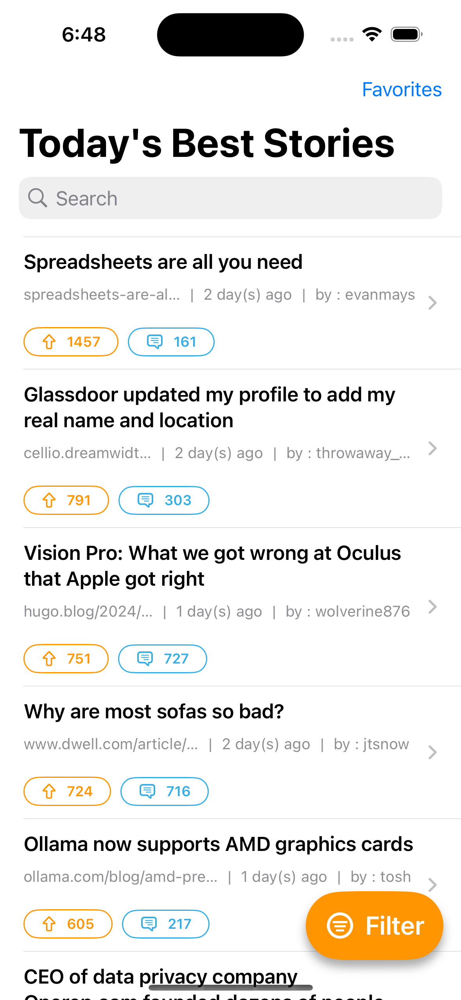
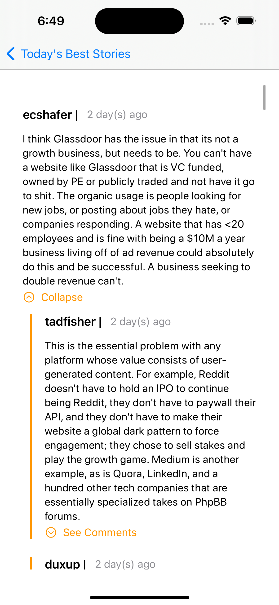

## Collection of MiniApps

### HackerNews API App

- An app for browsing the best stories from HackerNews 
- Utilized Swift MVVM, Concurrency/Structured Concurrency, Networking, JSON Decoder/Encoder, UserDefaults(for saving stories), [HackerNewsAPI](https://github.com/HackerNews/API?tab=readme-ov-file)

  

### Dog Facts App

- Dog facts API using Dog API by Kindruff
- Utilized Swift MVVM, Concurrency, Task, Async/Await,Refreshable, and JSONDecoder  

### Consistify 
Basic habit tracking app. Built this app to learn about SwiftData, ScrollViews, Environment variables, and Dates

 
