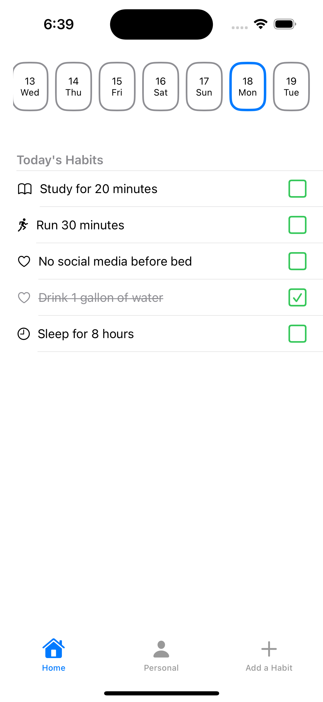
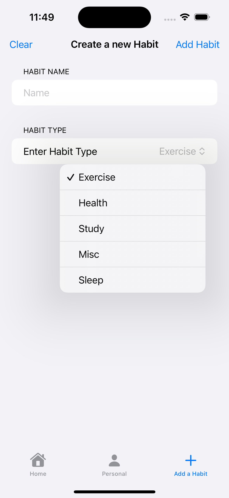

## Collection of MiniApps

### Dog Facts App

- Dog facts API using Dog API by Kindruff
- Utilized Swift MVVM, Concurrency, Task, Async/Await,Refreshable, and JSONDecoder  

### Consistify 
Basic habit tracking app. Built this app to learn about SwiftData, ScrollViews, Environment variables, and Dates

 
